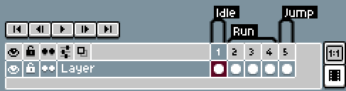
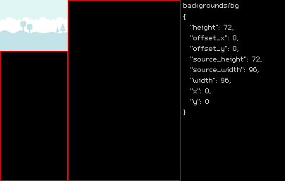

# sprak

Sprak is a sprite packing tool written in Python.


Sprak is built with 2D pixel art games in mind, supports the [Aseprite](https://www.aseprite.org/) file format, and exports simple PNG and JSON files for easy integration into any engine.

**Want to get started quickly?** If you have [uv](https://docs.astral.sh/uv/) installed, you can run sprak right now with `uvx sprak --help` and see instructions on how to use it.

## Using sprak as a standalone tool

The easiest way to run sprak is as a standalone tool using `uv`; no Python installation required:

```sh
# Pack the "examples/sprites/" folder into an "atlas.zip" file
uvx sprak examples/sprites --zip atlas.zip
```

## Using sprak as a Python module

Sprak can also be used as a Python module (for example: to integrate into an existing Python build script)

Install with `uv` or `pip`:

```sh
# with uv
uv add sprak

# with pip
pip install sprak
```

Then use the `sprak.pack()` function to pack the sprites:

```python
import sprak

sprak.pack("examples/sprites", dst_zip="atlas.zip")
```

Or create the atlas, sprites, and frames manually:

```python
from pathlib import Path

from sprak import Atlas, Frame, Sprite

atlas = Atlas()

# Add folder and file paths to the atlas
atlas.add_folder(Path("examples/sprites/characters"))
atlas.add_file(Path("examples/backgrounds/bg.png"))

# Create a sprite with a single frame and add it to the atlas
sprite = Sprite("bg_desert")
frame = Frame("bg_desert", Path("examples/backgrounds/bg_desert.png"))
sprite.frames.append(frame)
atlas.add_sprite(sprite)

# Write the atlas to a zip file
atlas.write_zip(Path("atlas.zip"))
```

## How does sprak work?

Sprak collects images from files and folders, packs them into a single image called a texture **Atlas**, and outputs the atlas image and data into a several different formats.

When image files are packed into the atlas they are stored as **Sprites** and **Frames**.

### Atlas

An atlas is both an _image_ and the _metadata_ about the sprites that were packed inside it. Sprak outputs the image as a PNG file and the data as a JSON file. These can be generated with the `--png` and `--json` options. A single ZIP file containing both the PNG and JSON data can be written with the `--zip` option.

See the [sprak JSON schema](sprak.schema.json) for a full breakdown of the JSON format.

### Frame

A frame is a single image - either a standalone image, or a single frame in an animated frame sequence (hence the name _frame_). Each frame occupies a rectangular space on the atlas.

### Sprite

A sprite is a higher-order abstraction that contains one or more frames. A sprite may represent a complex asset, such as Mario with running and jumping animations. Or it may represent a simple asset, such as a brick block texture.

### Frame and sprite names

Frames and sprites are automatically named based on the file's relative path to the source folder that was added.

```
🗀 sprites/
  🖻 Brick.png
  🗀 characters/
    🖻 Luigi.png
    🖻 Mario.png
```

```sh
uvx sprak sprites --json atlas.json
```

```json
{
  "frames": {
    "Brick": {...},
    "characters/Luigi": {...},
    "characters/Mario": {...}
  },
  "sprites": {
    "Brick": {
      "frames": [
        "Brick"
      ]
    },
    "characters/Luigi": {
      "frames": [
        "characters/Luigi"
      ]
    },
    "characters/Mario": {
      "frames": [
        "characters/Mario"
      ]
    }
  }
}
```

### Sequences

Sprak detects image sequences with the pattern `<sprite>.<frame_number>.<ext>`. When an image sequence is detected, the frames will be grouped into a single sprite in the atlas.

#### Example:

```
🗀 sprites/
  🗀 characters/
    🖻 Mario.0001.png
    🖻 Mario.0002.png
    🖻 Mario.0003.png
```

```sh
uvx sprak sprites --json atlas.json
```

```json
{
  "frames": {
    "characters/Mario.0001": {...},
    "characters/Mario.0002": {...},
    "characters/Mario.0003": {...}
  },
  "sprites": {
    "characters/Mario": {
      "frames": [
        "characters/Mario.0001",
        "characters/Mario.0002",
        "characters/Mario.0003"
      ]
    }
  }
}
```

### Animations

Frames can also be grouped into animations using the pattern `<sprite>.<animation>.<frame_number>.<ext>`.

#### Example:

```
🗀 sprites/
  🗀 characters/
    🖻 Mario.Idle.0001.png
    🖻 Mario.Jump.0001.png
    🖻 Mario.Run.0001.png
    🖻 Mario.Run.0002.png
    🖻 Mario.Run.0003.png
```

```sh
uvx sprak sprites --json atlas.json
```

```json
{
  "frames": {
    "characters/Mario.Idle.0001": {...},
    "characters/Mario.Jump.0001": {...},
    "characters/Mario.Run.0001": {...},
    "characters/Mario.Run.0002": {...},
    "characters/Mario.Run.0003": {...}
  },
  "sprites": {
    "characters/Mario": {
      "animations": {
        "Idle": [
          "characters/Mario.Idle.0001"
        ],
        "Jump": [
          "characters/Mario.Jump.0001"
        ],
        "Run": [
          "characters/Mario.Run.0001",
          "characters/Mario.Run.0002",
          "characters/Mario.Run.0003"
        ]
      },
      "frames": [
        "characters/Mario.Idle.0001.png",
        "characters/Mario.Jump.0001.png",
        "characters/Mario.Run.0001.png",
        "characters/Mario.Run.0002.png",
        "characters/Mario.Run.0003.png"
      ]
    }
  }
}
```

### Aseprite files

Sprak supports the Aseprite file format, and will extract frames, animations (using tags), and slices into the atlas.

Aseprite must be installed for this to work. Sprak will search for an `aseprite` alias, as well as common install paths for both the vanilla and Steam distributions of Aseprite.

Alternatively, you can set the `SPRAK_ASEPRITE_EXE_PATH` environment variable to explicitly tell sprak where to look.

#### Example



```
🗀 sprites/
  🗀 characters/
    🖻 Mario.aseprite
```

```sh
uvx sprak sprites --json atlas.json
```

```json
{
  "frames": {
    "characters/Mario.Idle.0001": {...},
    "characters/Mario.Jump.0001": {...},
    "characters/Mario.Run.0001": {...},
    "characters/Mario.Run.0002": {...},
    "characters/Mario.Run.0003": {...}
  },
  "sprites": {
    "characters/Mario": {
      "animations": {
        "Idle": [
          "characters/Mario.Idle.0001"
        ],
        "Jump": [
          "characters/Mario.Jump.0001"
        ],
        "Run": [
          "characters/Mario.Run.0001",
          "characters/Mario.Run.0002",
          "characters/Mario.Run.0003"
        ]
      },
      "frames": [
        "characters/Mario.Idle.0001.png",
        "characters/Mario.Jump.0001.png",
        "characters/Mario.Run.0001.png",
        "characters/Mario.Run.0002.png",
        "characters/Mario.Run.0003.png"
      ]
    }
  }
}
```

## Viewer

Sprak ships with a simple viewer application to view your atlas.

```sh
# View an atlas packed as a ZIP file
uvx sprak-view examples/example.zip
```

```sh
# View an atlas packed as separate JSON and PNG files
uvx sprak-view examples/example.json examples/example.png
```

## Exporting GIFs

Sprak can export an animated GIF of the sprites being packed. This can be useful for debugging, and is also just fun to watch.

_**Warning:**_ _Saving large images with lots of sprites can cause you to run out of memory or produce very large GIFs that don't play back very well._

```sh
uvx sprak examples/sprites --gif atlas.gif
```


```sh
uvx sprak examples/sprites --debug-gif atlas_debug.gif
```



## Using in a game

To use the atlas in a game, you need to reconstruct the original images that were packed into the atlas. All of the information required to do this is present in the atlas JSON data.

Frames can be located on the atlas using a frame's `x`, `y`, `width`, and `height` properties. Because sprak trims transparent edges to save space, the rectangular area the frame occupies in the atlas may differ from the original resolution of the file it was created from. When recreating the frame in your game, you should use the `source_width` and `source_height` properties to determine the image resolution, and the `offset_x` and `offset_y` properties to determine the frame's offset from the top-left corner of the canvas.

Sprites make it easy to turn the frames into animations, particularly when they come from an Asperite file. The `frames` property lists all frames in the sprite, whether or not the frames are explicitly part of an animation. The `animations` property lists a subset of sprite's frames for each named animation that was present in the source file.

If present, frame's `duration` property specifies the frame's duration in miliseconds.

## Development

Create venv and sync dependencies:

```sh
uv sync
```

Generate JSON schema:

```sh
uv run generate-schema.py
```

Build example files:

```sh
uv run generate-examples.py
```

## Credits

- Sprites by [kenney.nl](https://kenney.nl/)
- [m5x7 font](https://managore.itch.io/m5x7) by Daniel Linssen
